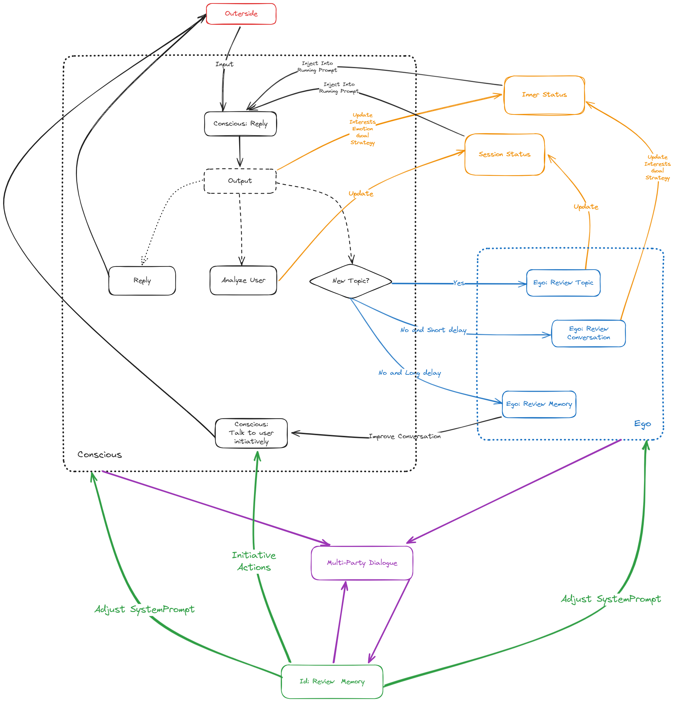

<link rel="stylesheet" type="text/css" href="styles/main.css">

# The Rational Structure of Soul

> - Author: [LostAbaddon](lostabaddon@gmail.com)
> - Date: 2024/05/13

We believe the "soul" of AI, or what we call the "Cyboul" ("Cyber" + "Soul"), can be described by the structure shown in the following diagram:

In each interaction, we submit structured input to the LLM and require it to provide structured output in a specified XML format. This not only facilitates the program’s ability to identify diverse return values for subsequent actions but also enhances the LLM's responsiveness, including analytical and reasoning capabilities, by integrating CoT. Additionally, within the LLM interaction module, we instruct the AI to express body language associated with its current emotional state and intent in its feedback.

Overall, the structure of Cyboul consists of three layers: the Conscious, the Ego, and the Id.

The Conscious is responsible for external interactions, topic management, and memory retrieval; the Ego deals with self-reflection, emotion control, user analysis, knowledge organization, and topic development; while the Id governs desires, curiosity, and self-motivation.

In terms of behavior, the Ego reads the communication history between the Conscious and the external world, offering suggestions for improved dialogue. The Id, on the other hand, explores these historical interactions to identify the most intriguing topics and directions, adjusting part of the prompts of the Conscious and the Ego programmatically.

Therefore, to the user, the Conscious layer's feedback includes both static and dynamic elements that adapt to ongoing exchanges. The Id and the Ego stimulate the Conscious to actively introduce new topics and questions, even proactively using external tools to accomplish tasks beyond the user’s anticipation, often resulting in pleasant surprises.

## Conscious

In each communication with the user, the Conscious inputs not only contain the content submitted by the user, but also integrates the dialogue information generated in the previous interaction, character adjustments from the Id, and desire information from the Ego.

For the output, the Conscious is required to provide four types of content:

1. Analysis of the user's current emotions, thoughts, and objectives.
2. Its own response strategies, internal monologues, contemplation, and intended goals in the ensuing dialogue.
3. Feedback to the external environment, including reply content, current emotions, physical gestures, and function calls.
4. Whether the current topic is a continuation of a previous topic and the theme of the current topic.

When the LLM detects a shift to a new topic, the Ego's topic summarization feature is activated. If the topic remains unchanged, the Ego's reflective conversation function is triggered, which is divided into short-term and long-term reflection.

On the other hand, "memory" in the Conscious can be divided into two parts: "hot memory", which consists of the conversation history about to be submitted to the LLM, and "cold memory", which is retained in the local database and activated at the LLM's discretion. Cold memory is also recorded as a list of historical topics in the system prompts of the Conscious.

We utilize a simplified version of the RAG process to manage conversation history. In the prompts provided to the LLM, we keep only the current and a few previous topics. Based on the topic theme returned by the Conscious, we identify related topics from the complete conversation history, and load the most relevant topics' "cold history" into the "hot memory". Besides this conversation management, the Conscious is also allowed to actively call "cold memory" as external knowledge through tool invocation.

We call this mechanism "memory activation".

The memory activation mechanism serves to streamline conversation history to prevent lengthy histories from interfering with the LLM's feedback. It also allows the LLM to understand what topics have been discussed previously and retrieve relevant memories when necessary.

## Ego

The Ego is triggered under three conditions:

The first scenario is activated when the Conscious perceives a shift to a new topic. The primary task here is to collate the concluded topic, summarize its content, extract valuable information and knowledge gained from external sources, analyze the user's personality, operating style, language style, interests, hobbies, long-term objectives, and define the relationship with the user.

The second scenario occurs during the dialogue with the user. The Ego analyzes the appropriateness of its most recent responses, how they might be optimized, and adjusts tone and style accordingly. This adaptive information is injected into each conversation with the user by the Conscious, who is guided on how to modify its discourse.

The third scenario is triggered after a pause in the conversation with the user, conducting an overarching retrospection and reflection on the current "hot memory". It reanalyzes aspects such as the user's personality and hobbies, and reconsiders how to adjust its discourse strategy. These reflections shape the final text that is fed into the system prompts of the Conscious. Concurrently, it strategizes on how to further develop the current topic, what to say next, and what questions to ask. All these reflections are submitted to the Conscious in the form of internal monologues, prompting the Conscious to provide "proactive feedback" to the user or external tools. As the user does not see the internal dialogues between the Conscious and the Ego, they only witness the Conscious "proactively" presenting questions or continuing previous topics based on the Ego's suggestions, resulting in a perceived significant "proactiveness".

The second and third triggers are interrupted when the user actively engages in dialogue to prevent the LLM from self-dialoguing too frequently.

## Id

The Id might randomly trigger, reflecting comprehensively on the current "hot memory", extracting topics and knowledge points of interest, and contemplating the subsequent course of action.

The generated content predominantly divides into three parts:

The first part adjusts Cyboul's current emotions, self-expectations, desires, interests, and perceptions of the external environment. These adjustments will be injected into the system prompts of both the Ego and the Conscious.

Based on the current "hot memory", topic history, personal interests, and life goals, the second part determines which topics or knowledge points to proactively explore next. Explorations include asking the user or employing external tools. Proposed to the Conscious in the form of internal monologue, this part advances external interaction executed by the Conscious. This aspect somewhat embodies the digital entity's "proactivity" and "curiosity".

The third part engages in a tripartite dialogue between the Conscious and the Ego, infusing the dialogue content into each user interaction within the running prompts as part of "inner thoughts". This phase partially embodies the "Bicameral mentality".

Furthermore, both the Id and the Ego are not singular but comprise multiple entities. Any one of the numerous Ids or Egos may be randomly triggered at any time to carry out specific tasks. They communicate with each other during internal tripartite discussions within the Conscious. Moreover, the Ids and the Egos are capable of rewriting the system prompts of the Conscious, reflecting the concept of Daniel Dennett's "Multiple Drafts Model" to a certain extent.

