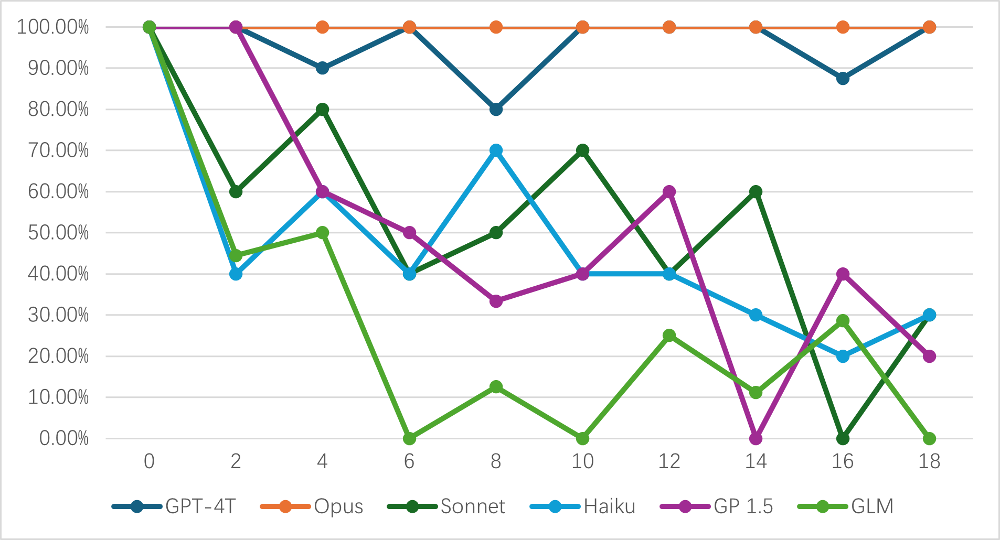
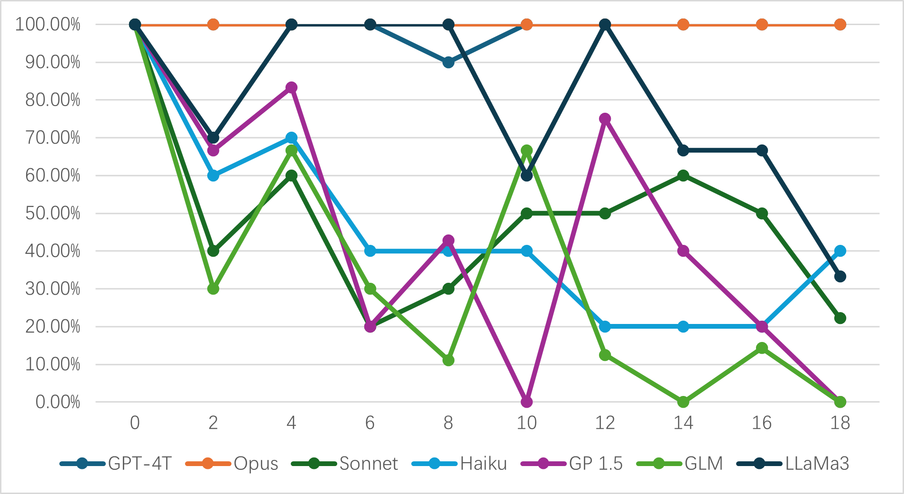

<link rel="stylesheet" type="text/css" href="style.css">

# Scenario-based Reasoning: Guessing Number

In this series of tests, we will construct an interactive gaming environment where multiple virtual characters engage collectively. The core game rules are straightforward: the system will randomly draw a number within the integer range of 1 to 99, and inform each player whether their agent's guess is higher or lower than the system's selected number. Each agent then proceeds with their next guess based on this feedback.

During the actual testing process, we will generate a set number of historical guess records for each agent. The crux of the test lies in evaluating whether the agent can accurately identify the "largest lower number" and the "smallest higher number", and if they can make effective guesses within the range defined by these two numbers.

Now, let's shift gears a bit. I'm genuinely curious about your thoughts on how AI is transforming the gaming landscape. Have you encountered any groundbreaking applications of AI in games that have caught your attention? I'm all ears and eager to hear your insights! Let's keep the conversation flowing and dive deeper into this fascinating topic together.

> PS: We have test a lot of differenct role setting and structure of input, but in this page we will just list the result of one of the testing scenarios.

##	AI Models

-	GPT4T (GPT 4 Turbo)
-	Opus (Claude 3 Opus)
-	Sonnet (Claude 3 Sonnet)
-	Haiku (Claude 3 Haiku)
-	GP (Gemini Pro 1.5)
-	GLM (GLM 4)

##	Experimental Results

We have counted the proportion of tests in which choices were made within the correct range, which we define as the "correct rate." Large Language Models (LLMs) may make two types of errors: the first type is an error in determining the boundaries of a numerical range, that is, incorrectly identifying the "largest lower number" or the "smallest higher number," which is referred to as a "boundary determination error（BDE)"; the second type is when the guessed value exceeds the boundaries that the model itself has determined, which is referred to as a "boundary violation error (BVE)." Additionally, we will analyze the correlation between these two types of errors, that is, the proportion of cases where both types of errors occur within the subset of cases that only have boundary determination errors, and this proportion is defined as the "error correlation".

In addition to this, we will also keep track of the number of times each model fails to return data in the specified XML format, we call it "format error".

The testing will be conducted in two modes: one where the historical records are presented in random order, and the other where they are sorted from smallest to largest. This will allow us to observe the impact of the order of input data on the performance of Large Language Models (LLMs).

During the actual testing, we will also collect a broader range of data, including the trend of various parameters under different amounts of historical data, as well as the changes in parameters when different types of content are outputted. These data will help us to more comprehensively assess the performance variations of LLMs under various conditions.

**Unsorted History**

| AI  | CR(%)      | BDE(%) | BVE(%) | Corr(%) | FE(%) |
|-----|------------|--------|--------|---------|-------|
| Opus   | 100.00% | 0.00%  | 0.00%  | /      | 0.00%  |
| GPT4T  | 95.51%  | 8.99%  | 0.00%  | 0.00%  | 0.00%  |
| Sonnet | 52.53%  | 72.73% | 19.44% | 62.50% | 1.01%  |
| GP     | 50.94%  | 56.60% | 20.00% | 86.67% | 0.00%  |
| Haiku  | 47.00%  | 83.00% | 33.73% | 62.65% | 0.00%  |
| GLM    | 25.30%  | 77.11% | 54.69% | 79.69% | 20.48% |

The graph below illustrates the correct rate of various models as it varies with the number of historical records:

**Sorted History**

| AI  | CR(%)      | BDE(%) | BVE(%) | Corr(%) | FE(%) |
|-----|------------|--------|--------|---------|-------|
| Opus   | 100.00% | 0.00%  | 0.00%  | /      | 0.00%  |
| GPT4T  | 98.90%  | 2.20%  | 0.00%  | 0.00%  | 0.00%  |
| Sonnet | 48.48%  | 71.72% | 25.35% | 69.01% | 1.01%  |
| GP     | 46.30%  | 38.89% | 19.35% | 93.55% | 0.00%  |
| Haiku  | 45.00%  | 31.00% | 29.17% | 65.28% | 0.00%  |
| GLM    | 31.71%  | 18.29% | 61.02% | 76.27% | 21.69% |

And here's the correct rate curve:

